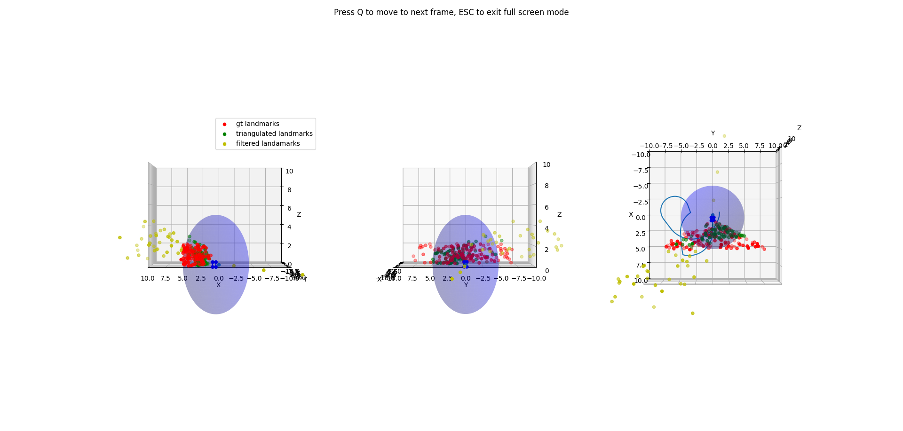

# Probabilistic Robotics Project 
To perform Planar visual SLAM I first have to obtain an estimate of the landmarks position in the world through triangulation, and then iteratively improve the landmark and trajectory estimation via bundle adjustment.

## Triangulation 

For each frame I iterate over all the visible landmark, using the given landmark_id, I check whether it is visible in the next frame. If that is the case, I triangulate the 2 points and obtain an estimate of the landmark real position. I check whether this estimate respects the following criterias: whether the estimated position is closer from the camera than z_max, wheter this estimate is not behind the camera (z<0) and whether the reprojection error is below a fixed threshold. This way I filter out some estimations that are clearly wrong, resulting in a more robust estimation

Therefore, for each consecutive frame I get an estimation of the 3D position of landmarks that are visible in both frames. The following plot shows the output of the triangulation for the first 2 frames, shown in different colors are the gt landmarks, the triangulated landmarks, and the estimations that are filtered out (To visualize more of this, uncomment the plot3d statement at line 25 in main.py) . 

After having done this for each copule of consecutive frames I end up having multiple estimations for each landmark, which I average to obtain the final estimated position.

It is worth noting that I also tried to obtain estimates by triangulating points correspondaces in all the frames, and not only consecutive frames. This leads to worse estimations, I think this is because there is more noise/error accumulation between frames that are far from each other compared to consecutive frames, thus leading to worse estimates.

## Bundle Adjustement

Before performing BundleAdjustment I need to define the Jacobian, which I computed using matlab (I lost the script some months ago and for some reason I had not uploaded it to the repository, sorry), and the boxPlus operation, which is quite standard (just got to make sure to properly normalize theta).

Then I perform Bundle Adjustment. To improve robustness to outliers I perform checks similar to the ones introduced in the triangulation phase: before computing the correction dx, I skip outliers, which will greatly influence the resulting correction, by not counting the landmark estimations that, when projected on the image plane, are either behind the camera (z<0) or outside of the image plane (x>cam.width or y>cam.height). Furthermore I weight the contribution to the correction by applying a robust kernel.

To visualize the correctnes of the solution, for each step I plot the current estimate against the original estimate and the ground truth, you can find these plots in the plot_best folder. At the end I also combined this in a gif that shows the evolution of the relative errors.

## Results

Finally, I obtain an RMSE of 0.1988.

I found the system to be overall very sensible to the damping and kernel_threshold parameters. The additional checks to avoid outliers are also key. I found a good combination of these parameters that lead to an almost perfect solution.

To reproduce as closely as possible my results, please use the conda environment provided:

conda env create -f environment_prob.yml
